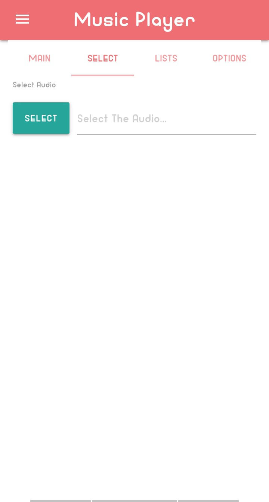

 # Music Player 🎵

## Introduction📝
This project is a simple music player implemented using PHP, CSS, and JavaScript. It utilizes the MaterializeCSS framework for its design and functionality.

## Features✨
- Play, pause, and skip tracks.
- Volume control.

## Technologies Used⚙️
- **PHP**: Used for components handling.
- **CSS**
- **JavaScript**
- **MaterializeCSS**
## How to Use 🔧
1. Clone this repository to your local machine.
2. Ensure you have PHP installed on your server or local environment.
3. Open the project directory and start a local server.
4. Navigate to the index.php file in your browser to access the music player interface.
5. Click "Select File" to upload multiple files.
6. Check the list, and then click the name of the music you want to play.
7. Then, go to the Main tab and click "Play" to start playing the music.
 
## Preview 🕵️
